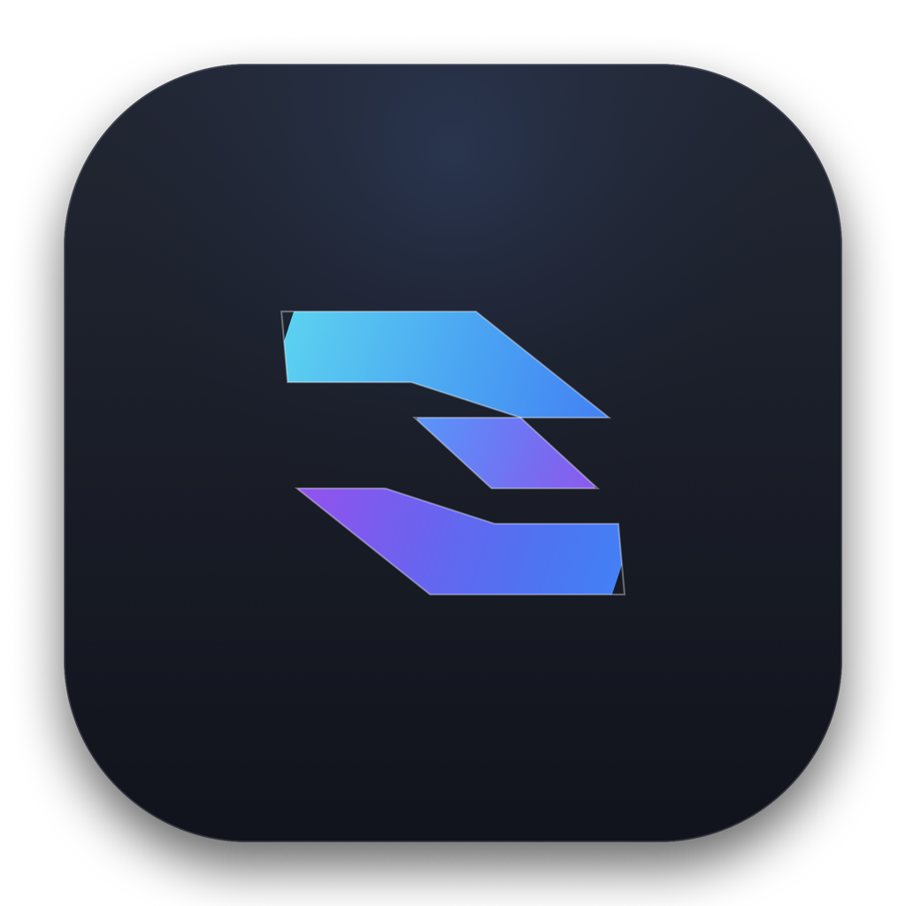

# DropQTT 🚀
> **Fast, Resilient Cross-Platform File Transfer Over MQTT**

[](https://github.com/Timskt/DropQTT/actions/workflows/release.yml)
[](https://tauri.app)
[](https://www.rust-lang.org)
[](LICENSE)

<p align="center">
  
</p>

**DropQTT** is a lightweight (~10–15 MB) desktop application built with **Tauri v2**, **Rust (`rumqttc`)**, and **React + Tailwind CSS**. It enables direct, secure, and verifiable file transfer across isolated network environments where standard HTTP uploads, P2P, SCP, or cloud storage are blocked, but standard MQTT broker connectivity (port `1883`, `8883` TLS, or WebSocket) is permitted.

---

## 🌟 Key Features

- ⚡ **Lightweight Footprint**: Packaged with Tauri v2 instead of Electron, yielding an installation size under 15MB and low memory consumption.
- 🧩 **Dynamic Chunking & Reassembly**: Conquers broker packet limits by breaking files into customizable chunks (64 KB to 2 MB) with streaming flow control.
- 🛡️ **Bit-Perfect SHA-256 Verification**: End-to-end cryptographic hashing ensures files are received without corrupted or missing packets.
- 🌐 **Ubiquitous Broker Support**: Works out of the box with public brokers (EMQX, HiveMQ, Mosquitto) or any private self-hosted MQTT v3.1.1/5.0 broker with optional TLS encryption and authentication.
- 🚪 **Room / Channel Isolation**: Share files simply by agreeing on a channel code (e.g. `#my-secure-room`).
- 🎨 **Pristine Modern UI & Brand Identity**: Designed with the `app-logo-design-engine` skill, featuring an origami vector mark rendered via native Swift + CoreGraphics producing true 32-bit RGBA (`ColorType 6`) icons without white squircle borders.
- 📦 **Cross-Platform Matrix**: Builds native installers for macOS (`.dmg`), Linux (`.deb`, `.AppImage`), and Windows (`.msi`, NSIS `.exe`).

---

## 📐 MQTT Transfer Protocol Specification

```
dropqtt/
  └── {channel}/
        ├── meta                          <- File metadata & SHA-256 (QoS 1)
        ├── chunk/{transferId}/{seq}      <- Binary raw chunk payloads
        └── ctrl/{transferId}             <- Transfer control: ACK, PAUSE, RESUME, CANCEL, COMPLETED
```

1. **Handshake (`meta`)**: The sender computes the full-file SHA-256 and broadcasts file metadata (`transferId`, `fileName`, `fileSize`, `chunkSize`, `totalChunks`, `sha256`).
2. **Chunk Streaming (`chunk`)**: The sender streams binary chunks to sequence-addressed topics with paced flow control. The receiver writes directly to temporary storage.
3. **Verification & Delivery (`ctrl`)**: Upon receiving the final chunk, the receiver re-calculates the complete SHA-256 hash. If verified, the file is atomically moved to the destination folder and a `COMPLETED` receipt is emitted.

---

## 🛠️ Development & Building

### Prerequisites
- Node.js >= 20, `pnpm`
- Rust toolchain (stable)
- macOS (Xcode Command Line Tools), Linux (WebKitGTK dev packages), or Windows (C++ Build Tools)

### Run in Development
```bash
# Install dependencies
pnpm install

# Start Tauri development mode
pnpm tauri dev
```

### Build Locally
```bash
# Build production bundle for current platform
pnpm tauri build
```

---

## 🚀 Automated Cross-Platform Release (GitHub Actions)

DropQTT packages installers for **macOS (Apple Silicon & Intel)**, **Ubuntu Linux**, and **Windows** via GitHub Actions.

Releases are triggered strictly by pushing semantic version tags:

```bash
# 1. Update version in package.json & src-tauri/tauri.conf.json
# 2. Commit and tag:
git tag -a v0.1.0 -m "Release v0.1.0"
git push origin v0.1.0
```

GitHub Actions will automatically build the artifacts and attach them to a new GitHub Release.
