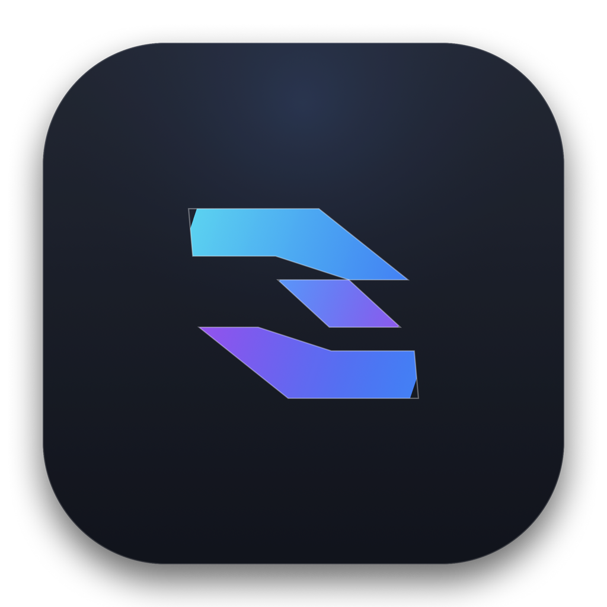

# DropQTT 🚀

> **一台 MQTT 工作台** —— 文件传输 · 收发控制台 · 数据桥接 · 消息历史 · 运维诊断

[English README](README.md) · **中文**

[](https://github.com/Timskt/DropQTT/actions/workflows/release.yml)
[](https://tauri.app)
[](https://www.rust-lang.org)
[](LICENSE)

<p align="center">
  
</p>

**DropQTT** 是用 **Tauri v2 + Rust（`rumqttc`）+ React + Tailwind CSS** 写的桌面 MQTT 工作台，
打包体积在十 MB 量级。它最早解决的是一个很具体的问题：**在 HTTP 上传、P2P、SCP、网盘全被封，
只放行 MQTT 端口（`1883` / `8883` TLS / WebSocket）的网络环境里，把文件可靠地传过去并证明它没坏。**
现在它是五个工作区——**文件传输 / MQTT 控制台 / 数据桥接 / 消息历史 / 运维诊断**，
外加设备仿真、验收场景、会话回放和无头 CLI。

贯穿全部功能只有一条主张：**失败不许看起来像成功。**
被 broker 拒绝、被过载丢弃、被截断存储、规则没能判定——都要说出来，而不是给一个绿灯。

---

## 🌟 核心能力

### 文件传输
- 🧩 **动态分块与重组**：按 broker 包上限把文件切成 64 KB–2 MB 的分块，带流控。
- 🛡️ **SHA-256 端到端校验**：收端重算全文件哈希，缺包/坏包不接受。
- 🔁 **抗噪重传**：NACK 驱动的缺块重传、僵尸任务看门狗、CONNACK 驱动的订阅恢复。
- 🧭 **全生命周期控制**：发送端可 PAUSE / RESUME / CANCEL，并传播给接收端；暂停期间看门狗不计时。
- ✅ **接收审批模式**：关掉自动接受后，文件在哈希通过后仍需人工 Approve / Reject。
- 🚪 **频道隔离**：约定一个频道码（如 `#my-secure-room`）即可互相传文件。

### MQTT 控制台
- 🌐 **通用 broker 支持**：EMQX / HiveMQ / Mosquitto 或任意自建 v3.1.1 / v5.0 broker，可 TLS 可认证。
- 🤝 **MQTT 5.0 完整支持**：按连接选协议版本、Clean Start，以及 Message Expiry、Content-Type、
  User Properties 等发布属性；订阅选项（No Local / Retain As Published / Retain Handling）跨重连保持。
- 📡 **多形态载荷查看**：Auto / JSON / SenML / Text / Markdown / HTML / CBOR / Base64 / Hex。
  其中 **CBOR 是无依赖实现的 RFC 8949** 编解码，**SenML 读取器同时支持 JSON 与 CBOR 两种编码**，
  会把 base name、继承单位、2²⁸ 绝对/相对时间规则解析成对齐的读数表；HTML 走 DOMPurify + 全沙箱 iframe。
- 🎛️ **用户自定义编解码脚本**：`function transform(topic, payload, qos, retain)` 跑在与桥接相同的
  QuickJS 沙箱里，**只显示不改写**——历史、导出、回放拿到的仍是原始字节。
- 🚦 **过载不糊脸的实时流**：后端约 10 Hz 批量推送（每批 200 条）并**显式计数溢出丢弃**，
  几千条/秒不会冲垮 webview；显示行被丢弃时 UI 会亮红字，而统计仍然精确。
- 🔁 **一键重放**：原样保留主题/载荷/QoS/retain/v5 属性；存储字节不完整的行（含旧版本写的捕获文件）
  **会被拒绝重放**，而不是悄悄发一个截断版出去。

### 消息历史与取证
- 🗂️ **全量落 SQLite**：控制台每一条都镜像进历史库（上限 10 万行），实时流滚走了还能查。
  主题与载荷全文检索、方向过滤、5m/15m/1h/24h/**全部时间**窗口，趋势图与结果列表**用同一套谓词**。
- 📈 **字段级取值取证**：填入 `temp.c`、`v[2]` 这样的路径，看这个字段**什么时候变的、之前是什么、
  到现在保持多久了**——"对比两条报文"里没人做的另一半。非 JSON 报文、不含该字段的报文、被截断存储的行
  各自计数并常驻显示；数值序列在**静默处断开**而不是用一条横线穿过四十分钟的无通信。
  对比卡发现的路径会直接变成可点的追查入口。
- 📋 **投递审计**：按报文里的序号字段逐主题给出缺口、重复、乱序与 p50/p95/最大时延（时延需要发布方
  自带发送时刻，不给就明说没测）。**缺口只表述为"不在我们已存下的内容里"，绝不表述为"broker 丢包"**；
  落在观测区间内读不出序号的行单独计数，因为那个洞可能就是它。负时延算作时钟倒挂，不进百分位。
- 🔍 **两条报文对比**：选两条报文，JSON **逐字段**给出变化路径（`temp.c`、`v[2]`），
  文本**逐行**做 LCS 差异，二进制按整体字节；传输字段差异（主题/方向/QoS/retain/长度/时间差）单列。
  比不了的会自己承认：嵌套过深、差异过多、差异块过大都会标注原因；
  任一条是**截断存储**的，就明说"字节一致不代表报文一致"。
- 🧵 **活动时间轴**：按 correlation data 跨主题配对 RPC 请求与应答。

### 数据桥接与转换
- 🔀 **Broker → Broker 与 Broker → HTTP**：两条独立桥接连接按主题规则转发；
  多行源过滤器一条订很多主题，支持排除子树、主题改写（保留/前缀/固定聚合/正则捕获/逐主题映射表）。
- 📜 **沙箱内 JavaScript 转换**：100 ms / 4 MB 限制、返回 null 即丢弃、表单内 dry-run 试跑。
- 🪝 **规则可以指向 Webhook**：JSON 信封或原始 body、自定义 header，附三个起步配方
  （遥测→业务 API、阈值告警、边缘站点聚合）。
- 📊 **可观测**：每规则限速、已转发/已丢弃计数、实时转发生意日志、规则 JSON 导入导出，
  重连后自动恢复记住的端点并在 CONNACK 上重设改过的 QoS。

### 观测与运维诊断
- 🔥 **实时主题流量榜 + 压测台**：按真实主题统计消息速率、字节量、峰值、最后活跃，秒级计数在高负载下仍精确；
  内置发布压测台（最高约 2 万条/秒），流量回环经过自己的订阅以验证统计与 UI 响应。
- 🌳 **主题树视图与设备视图**：把扁平主题按 `/` 组织成树，按层聚合出设备清单。
- 🛑 **静默看门狗**：某主题过滤器停止有流量时 POST 告警——这是普通 MQTT 客户端答不了的
  "这台设备是不是失联了"。每条规则独立阈值与冷却、支持通配符，且**恢复感知**：设备复报会清掉自己的计时器，
  反复抖动的节点不会被一个打开的冷却期吞掉；计时不放在会被 LRU 淘汰的主题表里，断线期间自动解除，
  不会把你的重连算成设备失联。
- 🩺 **运维诊断中心**：运行时/平台元数据、连接状态、传输活动、进料压力、历史库与桥接健康，
  外加下载目录可写性、历史可用性、TLS 姿态、订阅与过载指标等主动检查；
  导出/复制的报告**不含口令、用户名、证书路径**。
- 📈 **Prometheus 指标端点**：默认关闭、只绑回环、指标名与标签里不出现报文/主题/clientId/路径/凭据。

### 安全与本地化
- 🔐 **broker 口令进系统凭据库**：连接口令写进 Windows 凭据管理器 / macOS 钥匙串 / Secret Service，
  本地设置只留随机引用；**不存在把已存口令读回 UI 的路径**——引用只在开 socket 的地方解析。
  引用背后空了就明确报错要求重填，**不会退化成匿名连接**；没有可用凭据库的机器会在设置项上直说。
  Webhook 的敏感请求头走同一套机制。
- 🌍 **四语言界面**：简中 / 繁中 / English / 日本語，键位由脚本三方核对（四份文件 + `Translations` 接口）。
- 🎨 **四套主题**：Cyberpunk、OLED Obsidian、Nord、Solaris（亮），全部走 CSS 自定义属性。
- ♿ **键盘与响应式**：弹层捕获并归还焦点，关键交互可纯键盘到达，文档语言随界面语言，
  装饰动效尊重 `prefers-reduced-motion`。

---

## 📐 MQTT 传输协议规格

```
dropqtt/
  └── {channel}/
        ├── meta                       <- 文件元信息 + SHA-256（QoS 1）
        ├── chunk/{transferId}/{seq}   <- 二进制分块载荷
        └── ctrl/{transferId}          <- 控制报文：ACK / PAUSE / RESUME / CANCEL / COMPLETED
```

1. **握手（`meta`）**：发送端计算全文件 SHA-256，广播 `transferId`、`fileName`、`fileSize`、
   `chunkSize`、`totalChunks`、`sha256`。
2. **分块流式（`chunk`）**：按序号寻址的主题流式发送，接收端直接写入临时存储。
3. **校验与交付（`ctrl`）**：收到最后一块后重算全文件哈希，通过则原子移动到目标目录并发出 `COMPLETED` 回执。

---

## 🛠️ 开发与构建

### 依赖
- Node.js ≥ 20、`pnpm`
- Rust stable 工具链
- macOS（Xcode Command Line Tools）、Linux（WebKitGTK 开发包）、
  或 Windows（C++ Build Tools，**必须包含 Windows 10/11 SDK**——只有 `link.exe` 不够，
  缺 SDK 的 `ucrt.lib` / `kernel32.lib` 时任何 Rust 二进制都链接不了）

### 开发模式
```bash
pnpm install
pnpm tauri dev
```

### 测试与门禁
```bash
pnpm test                              # 前端单测（vitest：历史解码/重放/导出/图表填充、报文对比算法等）
pnpm test:ui                           # Playwright 真 DOM（mock 掉的 Tauri IPC）
(cd src-tauri && cargo test)           # Rust：SQLite 历史、桥接规则、webhook、QuickJS 沙箱
(cd src-tauri && cargo clippy --all-targets -- -D warnings)
python scripts/check-i18n-parity.py    # 四语言 + Translations 接口三方核对
```

`pnpm test:ui` 会在 `127.0.0.1:1420` 起 Vite，用打桩的 IPC 驱动真实组件，
所以它验证的是渲染与交互，不是真实 MQTT 或 HTTP 网络。

**当前门禁数字（2026-10-08 实测）**：Rust 364 lib + 1 集成、前端单测 225、真 DOM 249、
`cli-gate` 37 项 + `scenario-gate` 26 项、`tsc --noEmit` 干净、ESLint 0 error / 10 warning
（预算锁死在 10）、i18n 1010 键 × 4 语言。

CI（`.github/workflows/ci.yml`）有 `frontend` / `ui` / `backend` / `cli` 四个作业，push 即跑，
**CI 是权威门禁**。

### 无头 CLI 门禁（本地一条命令复现 CI 环境）
```bash
(cd src-tauri && cargo build --bin dropqtt-cli)
bash scripts/gate-rig.sh               # 起一个与 CI 同构的一次性 broker 并跑完两项门禁
```

---

## 🤖 无头 CLI（`dropqtt-cli`）

与桌面端**同一套 Rust 协议引擎**，只是没有窗口，好在 CI 里断言 broker 契约。
它直接链 `transport` / `assertions` / `topic`，而不是用第二个客户端库去说 MQTT——
**一个和自己 GUI 说法不一致的 CLI，比没有 CLI 更糟。**

```bash
cargo build --bin dropqtt-cli          # 在 src-tauri/ 下
dropqtt-cli connect --host 127.0.0.1 --port 1883
dropqtt-cli sub --topic 'devices/#' --count 20 --payload
dropqtt-cli pub --topic devices/gw1/cmd --payload '{"mode":"ota"}' --qos 1 --retain
dropqtt-cli rpc --topic devices/gw1/get --payload '{}' --response-topic cli/reply --timeout 5s
dropqtt-cli verify --topic 'devices/#' --assert '$.tempC < 80' --for 30s --junit > report.xml
dropqtt-cli verify --scenario nightly.dqscn --for 30s --json > verdict.json
dropqtt-cli verify --scenario nightly.dqscn --for 30s --bench-rate 2000 --bench-qos 1
```

`verify` 用的是桌面端自己的断言语法（`$.field <op> <value>`、`qos >= 1`、`$.fw present`）
和同一套 SUBACK/PUBACK 裁决，所以在这里通过的规则，装到控制台上含义不变。

`--scenario` 读取验收面板保存的 `.dqscn`：里面的订阅会被装上、断言规则与命令行传入的合并，
判定由面板显示的同一份 Rust 代码产出。性能条（`minRate` / `maxP99Ms` / `maxLost`）
只有在用 `--bench-rate N`（配 `--bench-size B`、`--bench-qos 0|1|2`）自己驱动负载时才真正被测量：
CLI 在 `--for` 窗口内向条目的 bench 主题发布，然后最多等 2 秒收尾确认再判定。
速率是显式参数而不从 `minRate` 读取，因为"正好给到门槛值"什么也证明不了。
不给负载就报**未证明**（退出码 4）；而设置里根本不可能满足的条——QoS 0 下要求 `maxLost`、
载荷太小装不下时间戳却要求 `maxP99Ms`——**在连接之前就被拒绝**。

**退出码是契约**：`0` 通过、`1` 被拒绝或规则被违反、`2` 命令行用错、`3` broker 不可达、
`4` **未证明**。第 4 个之所以存在，是因为"没有报文匹配这个过滤器"和"规则成立了"
对一个不知情流水线来说长得一模一样——**对着一个没人真正在连的 broker 亮绿灯**，
正是这个项目花时间要消灭的那类失败。

口令**绝不从命令行读取**（参数会进进程表和 shell 历史），用 `--password-env VAR` 指向环境变量。

契约由 `scripts/cli-gate.sh` 执行：它拿真二进制对活 broker 跑，逐个断言退出码，
**包括那些必须非零的**。CI 每次 push 都做。值得一提的是它在第一条断言之前会先做
**broker 身份自检**——匿名发布必须被拒、越权主题必须回来 `0x87`——因为"这个端口有人应答"
并不等于"应答的是我配的那个 broker"，而这一区分曾经让整个门禁对着别人的 broker 白跑六次。

```bash
# 对任意已有 broker
bash scripts/cli-gate.sh ./src-tauri/target/debug/dropqtt-cli 127.0.0.1 18831

# 对带 ACL 的 broker，断言一次真拒绝（0x87 → 退出码 1）
GATE_DENY_TOPIC=secret/never-granted bash scripts/cli-gate.sh \
  ./src-tauri/target/debug/dropqtt-cli 127.0.0.1 18831

# 场景判定，包括那些必须停在 4 的
bash scripts/scenario-gate.sh ./src-tauri/target/debug/dropqtt-cli 127.0.0.1 18831
```

---

## 🚀 跨平台自动发布（GitHub Actions）

通过 GitHub Actions 打包 **macOS（Apple Silicon 与 Intel）**、**Ubuntu Linux**、**Windows** 安装包。
发布只由语义化版本 tag 触发：

```bash
# 1. 同时改四处版本号：package.json、src-tauri/tauri.conf.json、
#    src-tauri/Cargo.toml、以及 Cargo.lock 里的 dropqtt 条目
#    （workflow 会校验 tag 与应用版本是否一致，不一致直接失败）
# 2. 提交并打 tag：
git tag -a v0.10.2 -m "Release v0.10.2"
git push origin v0.10.2
```

Actions 会自动构建产物并挂到一个新的 GitHub Release 上。

---

## 📚 更多文档

| 文件 | 讲什么 |
| --- | --- |
| [`docs/PROJECT_STATUS_2026_10.md`](docs/PROJECT_STATUS_2026_10.md) | 当下实测规模、门禁数字、能力清单、已知限制 |
| [`docs/ITERATION_2026_09.md`](docs/ITERATION_2026_09.md) | 逐轮记录**为什么**这么做，以及哪些假设被推翻了 |
| [`docs/ROADMAP_vs_MQTTX.md`](docs/ROADMAP_vs_MQTTX.md) | 与 MQTTX 的差异定位：观测与转换做壁垒，不追客户端广度 |
| [`docs/HANDOFF_2026_10.md`](docs/HANDOFF_2026_10.md) | 新机器从克隆到全绿的完整路径、环境陷阱、发版流程 |
| [`AGENTS.md`](AGENTS.md) | 给编码代理/接手者的硬性约束与常用命令 |

## 📄 许可

MIT —— 见 [LICENSE](LICENSE)。
